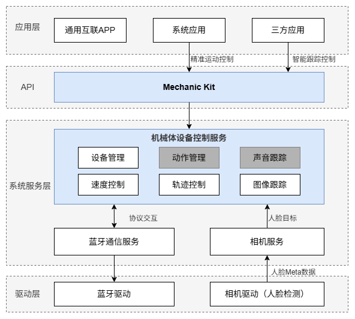

# 机械体设备控制器

## 简介

机械体设备是一个具备自主运动能力的智能机械（比如云台，机械臂，自动升降架，机械车等）。

机械体设备控制器是OpenHarmony操作系统中用于控制机械体设备的模块。它提供查询机械体设备连接状态和控制机械体设备运动的接口，方便连接和控制机械体设备。

机械体设备控制器包含以下常用功能：

- 机械体设备信息查询。
- 机械体设备状态查询。
- 机械体设备运动控制。

## 系统架构

**图 1**  OpenHarmony机械体设备控制器架构图<a name="fig4460722185514"></a></b>



- **机械体设备控制服务**: 提供设备管理与运动控制核心能力，支持通过设定位置轨迹和运动速度来操控设备动作；基于摄像头人像识别结果，实现人物自动跟踪转动。后续将新增动作管理及声音方向驱动等能力。轨迹控制、速度控制、动作管理模块属于运动控制。图像跟踪、声音跟踪模块属于状态感知。设备管理模块则作为基础支撑，贯穿全系统。
- **[通用互联APP（开发中）](https://gitcode.com/ohos-oneconnect/ohos-connect-hap)**: OpenHarmony设备的可选系统应用。负责发现和过滤机械体设备，方便设备开发者快速发现满足OpenHarmony机械体控制协议的配件设备，并通知机械体设备控制服务完成连接。
- **Mechanic Kit**: 机械体设备控制器开发套件，是机械体设备控制服务对外提供的接口集合。它为应用提供查询机械体设备、控制机械体设备等接口能力。
- **蓝牙通信服务和相机服务**：机械体设备控制服务依赖的关键能力。依赖蓝牙通信服务与机械体设备进行通信；依赖相机服务获取相机参数和目标检测结果。
- **蓝牙驱动**: 实现无线通信的核心组件，包含蓝牙的通信控制协议栈，负责管理机械体设备控制器与机械体设备之间的蓝牙连接，支持数据传输、指令下发与状态反馈，确保远程控制与实时交互的稳定可靠。
- **相机驱动**: 系统中实现人脸检测的模块，如果设备开发者需要支持机械体设备的人脸智能跟踪能力，必须在相机驱动中实现人像识别功能，并通过OpenHarmony相机HDI标准接口上报人脸检测结果。

## 目录

仓目录结构如下：

```shell
distributedhardware_mechbody_controller
├── etc             # 机械体设备控制器服务初始化配置
├── interface       # 机械体设备控制器接口及NAPI转换
├── sa_profile      # 机械体设备控制器SA配置
├── service         # 机械体设备控制器接口实现
├── test            # 机械体设备控制器测试代码
```

## 约束

- OpenHarmony开发设备必须支持 BLE（Bluetooth Low Energy）协议。
- OpenHarmony开发设备的相机驱动具备摄像头人脸检测能力，支持上报人脸Metadata数据，否则人脸跟踪功能不可用。
- 被控的机械体设备必须符合OpenHarmony MechanicKit南向协议标准（该标准待发布），如厂商已对外宣称该设备支持OpenHarmony MechanicKit。
- [通用互联APP](https://gitcode.com/ohos-oneconnect/ohos-connect-hap)中该功能正在开发。目前，可以使用test目录下的测试Demo进行机械体设备发现，或自行开发设备发现功能。
- 机械体设备南向协议正在标准化过程中，当前待提供。

## [指南及API](https://gitcode.com/onetwothreedrink/docs/blob/master/zh-cn/application-dev/reference/apis-mechanic-kit/Readme-CN.md)

## 示例教程
机械体设备控制器模块提供了[设备转动控制开发指南](https://gitcode.com/openharmony/docs/blob/master/zh-cn/application-dev/mechanicManager/rotation-control-guide.md)，系统应用可以对机械体设备进行高阶控制，如轨迹控制和速度控制等。同时提供了[智能拍摄跟踪开发指南](https://gitcode.com/openharmony/docs/blob/master/zh-cn/application-dev/mechanicManager/camera-tracking-guide.md)(支持三方应用)，三方应用可以查询已连接的机械体设备，控制启动和关闭智能跟踪功能等。

## API参考

[系统API参考](https://gitcode.com/openharmony/docs/blob/ca6a74112dca41d78b4bb2ca2612aca7d2bce450/zh-cn/application-dev/reference/apis-mechanic-kit/js-apis-mechanicManager-sys.md)和[开放API参考](https://gitcode.com/openharmony/docs/blob/ca6a74112dca41d78b4bb2ca2612aca7d2bce450/zh-cn/application-dev/reference/apis-mechanic-kit/js-apis-mechanicManager.md)分别提供了接口的说明文档，可以帮助开发者快速查找到指定接口的详细描述和调用方法。

## 相关仓

distributedhardware_mechbody_controller
